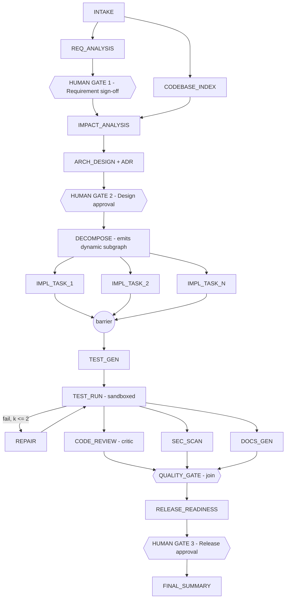

# ASES — Agentic Software Engineering System
## Implementation Plan & Design Rationale

> ## ⚠️ SUPERSEDED — historical record
>
> This is the **first** plan, written before the scope expansion. It is retained deliberately as decision lineage, not as current guidance. Its architectural theses (§2.1 kernel owns control flow, §2.2 event log as source of truth) still hold and are carried forward verbatim; almost everything else has moved.
>
> **Current plans:**
> - [`02-ORCHESTRATOR-IMPLEMENTATION-PLAN.md`](02-ORCHESTRATOR-IMPLEMENTATION-PLAN.md) — the orchestrator
> - [`03-URL-SHORTENER-WORKLOAD-PLAN.md`](03-URL-SHORTENER-WORKLOAD-PLAN.md) — the workload
> - [`04-DATA-AND-MIGRATION-STRATEGY.md`](04-DATA-AND-MIGRATION-STRATEGY.md) — schema lifecycle and migration safety
> - [`01-PLAN-DELTA-ANALYSIS.md`](01-PLAN-DELTA-ANALYSIS.md) — why each change was made
>
> **Known-stale in this document:** the Python `legacy-bank` fixture and `ast` indexer (replaced by a .NET workload, brownfield deferred to Stage 2); SQLite/JSONL persistence (replaced by PostgreSQL); the single-graph workflow (now selected per requirement class); the "single run" assumption (now repeated replayable runs).

**Status:** Superseded — see banner above
**Date:** 2026-09-12
**Goal:** A working prototype that transforms a requirement into a reviewable engineering outcome using an agentic execution model.

---

## 0. Confirmed decisions

| Decision | Choice | Why |
|---|---|---|
| Runtime | Python 3.13 | Ecosystem fit for agent/LLM work; the `ast` stdlib gives real (not simulated) brownfield code analysis; pydantic gives enforceable artifact contracts. |
| LLM access | Pluggable provider; deterministic **cassette** replay is the default | A reviewer can run the full demo offline with no API key and get identical results; a real Anthropic adapter proves genuine agency when a key is present. |
| Brownfield target | Bundled seeded legacy repo at `fixtures/legacy-bank/` | Self-contained and reproducible; lets the demo requirement genuinely ripple across modules, schema, and APIs. |
| Interfaces | CLI + local web dashboard | Orchestration and governance are the scored differentiator — they must be *visible*, not merely logged. |

---

## 1. Requirement understanding (what is actually being asked)

Restated as an engineering problem:

> Build a system where a **deterministic, governed control plane** drives **non-deterministic LLM agents** through the full SDLC for a single change request against an existing codebase, producing reviewable artifacts, with every decision auditable, every high-impact action human-gated, and every failure bounded and recoverable.

The brief lists eight features, but they are not peers. Feature 4 (Workflow Orchestration) is explicitly the critical differentiator, and it subsumes Feature 7 (Controlled Autonomy) and most of Feature 6 (Validation and Risk Control). Features 1, 2, 3 and 5 are *agents that plug into* the orchestrator. Feature 8 is a report generated *from* the orchestration event log.

**Therefore the system is an orchestration kernel with agents as plugins — not a chain of agents with logging bolted on.** The rest of this plan follows from that reading.

### Explicit success criteria (the brief supplies none — proposed)

A run is a success if, from one natural-language requirement against `fixtures/legacy-bank/`, the system produces:

1. A normalized `RequirementSpec` with at least three genuine ambiguities surfaced and resolved at a human gate.
2. An impact analysis naming the correct impacted modules, endpoints and tables, verified against a hand-authored ground-truth file.
3. A task graph with real dependencies, where at least two tasks execute in parallel and at least one is blocked by a barrier.
4. Code and tests that pass `ruff`, `mypy` and `pytest` inside the sandbox, with a coverage delta of zero or better.
5. At least one bounded retry, one policy interception, and one rollback demonstrated (fault-injection mode).
6. A re-plan triggered by amending an already-approved upstream artifact, with correct minimal re-execution and re-approval.
7. A complete hash-chained audit log from which all reliability metrics are *derived*, not separately instrumented.
8. A final engineering summary generated from that log.

---

## 2. The two central architectural decisions

### 2.1 Invert control — the engine owns control flow, agents own content

Agents are near-pure functions:

```
(typed input contract + scoped context) -> (typed artifact + confidence + rationale + citations)
```

Agents **never** decide what runs next, never write to the real repository, and never call each other.

**Why.** The dominant failure mode of "agentic" systems is letting the model drive control flow. The moment it does, you lose determinism, auditability, and any ability to *enforce* governance rather than merely request it. Bounded retries, rollback, gates, policy, budget caps and replay are only implementable if control flow lives in deterministic code. This inversion is what makes every governance requirement in the brief achievable rather than aspirational.

**Trade-off.** Less emergent, less "impressive" autonomy — the graph shape is authored rather than discovered. Mitigated by dynamic subgraph generation (§4.2), where the decomposer emits nodes at runtime, so the graph is not fully known at authoring time but is still validated and policy-checked before it is admitted.

### 2.2 The run is an append-only, hash-chained event log; state is a fold over it

There is no mutable "run state" of record. `RunState = reduce(apply, events, initial)`.

**Why this one decision pays for six requirements at once:**

| Requirement | Falls out of the event log |
|---|---|
| Audit-grade observability | The log *is* the audit trail; there is nothing to instrument separately. |
| Decision lineage | Every artifact event carries its producing node, agent, prompt hash, model and input artifact hashes. |
| Reliability metrics | Success rate, retry and rollback frequency, MTTR and latency are derived by replaying the log, so they cannot drift from reality. |
| Rollback | Compensating events plus content-addressed artifacts make "return to the state at event N" well defined. |
| Checkpoint, resume, safe-stop | Persist the log; resume is a re-fold. |
| Deterministic testing | Replay a recorded log and assert the kernel reaches identical state. |

Each event carries `prev_hash = sha256(prev_event)`, making the log **tamper-evident** — a meaningful property for a financial-services change-control story.

---

## 3. Component architecture

```
ases/
  kernel/                  # CONTROL PLANE — contains zero LLM calls
    events.py              event types; append-only hash-chained log
    state.py               RunState fold; node state machine
    graph.py               WorkflowGraph: nodes, edges, join semantics, cycle budgets
    scheduler.py           readiness evaluation, parallel dispatch, barrier sync
    gates.py               entry/exit gate predicates -> PASS | FAIL | ESCALATE
    policy.py              declarative guardrail engine (YAML rules)
    recovery.py            bounded retry, fallback, compensation/rollback, safe-stop
    replan.py              dirty propagation, minimal re-execution set, re-approval
    checkpoint.py          durable snapshot and resume
    metrics.py             reliability metrics derived from the log
  agents/                  # AGENT PLANE — LLM-backed, stateless, sandboxed
    base.py                Agent ABC: input/output contract, capability manifest, budget
    requirements.py        intent, ambiguity detection, normalization
    architect.py           impact analysis and ADR authoring
    decomposer.py          task graph with dependencies -> dynamic subgraph
    implementer.py         code patches (sandbox only)
    tester.py              unit and integration tests
    reviewer.py            adversarial critic with rubric
    docs.py                API docs, changelog, README deltas
    release.py             release-readiness assessment
  context/
    store.py               content-addressed artifact store
    lineage.py             provenance DAG (artifact -> producer -> inputs)
    retriever.py           scoped context assembly (prevents prompt bloat)
  codebase/                # BROWNFIELD REASONING — static, deterministic
    indexer.py             AST index, symbol table, import graph
    api_map.py             FastAPI route extraction -> endpoint inventory
    data_flow.py           model -> table -> endpoint tracing
    impact.py              blast radius from a changed symbol set
  providers/
    base.py                LLMProvider protocol
    anthropic_provider.py  claude-opus-5 / claude-sonnet-5, with model tiering
    cassette_provider.py   record and replay, keyed by hash(prompt + schema)
    cassettes/
  validation/
    schema.py              pydantic contracts for every artifact type
    static.py              ruff and mypy runners (sandboxed)
    dynamic.py             pytest runner and coverage delta (sandboxed)
    critic.py              LLM-as-judge with an explicit rubric
  sandbox/
    workspace.py           git-backed scratch copy; promotion produces a diff
  interfaces/
    cli.py                 typer CLI
    web/                   FastAPI + SSE + single-page dashboard
  fixtures/legacy-bank/    the brownfield target
  runs/                    per-run event logs, artifacts, checkpoints
```

---

## 4. The orchestration layer (the differentiator)

### 4.1 SDLC workflow graph



### 4.2 Why this is non-linear and stateful, concretely

The brief does not define "non-linear". We define it as five demonstrable properties, each with a test:

1. **Parallel fan-out with barrier join.** `REQ_ANALYSIS` runs alongside `CODEBASE_INDEX`; N implementation tasks run in parallel; `CODE_REVIEW`, `SEC_SCAN` and `DOCS_GEN` run in parallel and join at `QUALITY_GATE`. Join semantics are declared per node: `ALL`, `ANY`, or `QUORUM(n)`.
2. **Conditional cycle.** `TEST_RUN -> REPAIR -> TEST_RUN`, bounded by both iteration count and token budget, with safe-stop on exhaustion.
3. **Dynamic subgraph generation.** `DECOMPOSE` emits nodes and edges at runtime. The emitted subgraph is schema-validated, cycle-checked and policy-checked *before* admission — autonomy that is bounded rather than unbounded.
4. **Backward re-planning.** Amending an approved upstream artifact marks descendants `STALE` through the lineage DAG, computes the minimal re-execution set, and **revokes prior human approvals whose underlying content changed**. That last clause is the governance-critical half: re-planning must never silently inherit an approval granted against different content.
5. **Divergent recovery paths.** Failure routes through retry, then fallback (degraded output plus a human flag), then compensation, then safe-stop. These are distinct graph paths, not exception handling.

### 4.3 Node lifecycle

```
PENDING -> READY -> ENTRY_GATE -> RUNNING -> VALIDATING -> EXIT_GATE -> SUCCEEDED
                        |            |            |             |
                     BLOCKED     RETRYING     REPAIRING   AWAITING_APPROVAL
                                     |                          |
                                 FALLBACK                    REJECTED
                                     |                          |
                                  FAILED -> COMPENSATING -> ROLLED_BACK
                                     |
                                  HALTED (safe-stop)

  any SUCCEEDED node -> STALE (upstream changed) -> back to READY
```

Every transition emits an event. The audit trail is not a side effect; it is the mechanism.

### 4.4 Gates

**Entry gate** — required input artifacts present and schema-valid; upstream dependencies `SUCCEEDED`; policy pre-checks pass; remaining token, time and cost budget sufficient; the agent capability manifest permits the requested tools and write paths.

**Exit gate** — output schema-valid; validators L1–L4 pass; agent self-reported confidence at or above threshold; policy post-checks pass (no secrets, no forbidden imports, no out-of-scope file writes); **human approval required whenever `impact_class >= HIGH`**.

Outcomes are `PASS`, `FAIL` or `ESCALATE`. An `ESCALATE` pushes to the human approval queue carrying a diff, a rationale and the lineage trail — the reviewer is handed evidence, not just a yes/no prompt.

### 4.5 Policy guardrails (declarative, `policies/*.yaml`)

- **Change control** — no autonomous edits to `**/migrations/**`, `**/auth/**` or `**/*schema.sql`; a cap on files touched per task; no breaking public-API change without a recorded ADR and a version bump.
- **Security** — secret-scan every generated artifact; dependency allowlist; ban `eval`, `exec` and `subprocess(shell=True)` in generated code; require parameterized SQL; and treat **repository content entering prompts as untrusted data** (prompt-injection containment).
- **Compliance** — every code artifact carries provenance; every HIGH-impact decision has a recorded ADR; the audit log is append-only and hash-chained.
- **Autonomy** — a per-agent capability manifest (allowed tools, writable paths, token budget). Agents cannot modify their own manifest, and escalation attempts are logged as violations.

### 4.6 Reliability metrics (all derived from the log)

Success rate per run and per node type; retry frequency; rollback frequency; fallback rate; **MTTR**, defined explicitly as wall-clock time from the first `NODE_FAILED` event to the next `NODE_SUCCEEDED` for the same node id (run-level MTTR reported separately); end-to-end and per-stage latency at p50 and p95 across runs; human intervention rate and gate rejection rate (together an "autonomy index"); first-pass validation rate as an agent-quality proxy; and token and dollar cost per run.

---

## 5. Brownfield fixture and the demo requirement

`fixtures/legacy-bank/` — a small but realistic Python monorepo with deliberate legacy characteristics:

- `services/accounts/` — FastAPI CRUD, `models.py`, `repository.py`; the only well-tested service
- `services/payments/` — transfer endpoint and an HTTP client into accounts, with **no transaction boundary and no idempotency key**
- `services/notifications/` — event consumer
- `shared/db/schema.sql` and `shared/events.py`, the latter a god-module

**Demo requirement:** *"Add daily transfer limits per account, with an override for premium customers."*

Chosen because it ripples genuinely — DB schema plus migration, the accounts model, the payments validation path, a new API field, a breach notification, and backward compatibility for existing clients — and because it carries real ambiguity: is "daily" a calendar day or a rolling 24-hour window, and in whose timezone? Does the limit apply to the sender, the receiver, or both? Who may grant an override, and is that grant audited? What happens to in-flight transfers when a limit is lowered? Those are the ambiguities Gate 1 exists to resolve, and none of them were manufactured for the demo.

A hand-authored `fixtures/legacy-bank/GROUND_TRUTH.md` records the correct impact set, so the analyzer is scored rather than self-graded.

---

## 6. Validation strategy — defense in depth

| Layer | Mechanism | On failure |
|---|---|---|
| L1 Schema | pydantic validation of every agent output | one repair prompt, then fail the node |
| L2 Static | `ruff` and `mypy` on generated code in the sandbox | route to `REPAIR` |
| L3 Dynamic | `pytest` plus coverage delta, in an isolated sandbox | route to `REPAIR`, bounded |
| L4 Semantic | adversarial critic agent, explicit rubric, must cite `file:line` | escalate to human |
| L5 Human | approval gates with diff, rationale and lineage | reject, then re-plan |

**Agents never write to the real repository.** All work lands in a git-backed sandbox workspace, and promotion produces a reviewable patch. Rollback is therefore trivially correct — discard the sandbox — and the safety story is structural rather than procedural.

---

## 7. Build phases

| Phase | Deliverable | Exit criteria |
|---|---|---|
| 0 | Artifact contracts (pydantic), repo skeleton, `fixtures/legacy-bank/` and ground truth | the fixture runs its own tests green |
| 1 | **Kernel**: events, state fold, graph, scheduler, checkpoint | kernel unit tests pass using *fake* agents, with zero LLM involvement |
| 2 | Provider abstraction and cassettes; `requirements` and `architect` agents | offline replay produces identical output twice |
| 3 | Codebase reasoning: indexer, api_map, data_flow, impact | impact analysis matches `GROUND_TRUTH.md` |
| 4 | Decomposer, dynamic subgraph admission, implementer and tester, sandbox | parallel tasks execute and join correctly |
| 5 | **Governance**: gates, policy engine, approvals, retry/fallback/rollback/safe-stop, re-plan | a fault-injection suite demonstrates each control |
| 6 | Validation stack L1–L4 plus critic | generated code passes ruff, mypy and pytest |
| 7 | Metrics, CLI, and web dashboard (live DAG, approvals, lineage, metrics, violations) | a full run is observable end to end in the browser |
| 8 | Docs agent, release readiness, final-summary generator | the summary is generated *from the log*, not hand-written |
| 9 | End-to-end demo, cassette recording, README, engineering summary | `ases run --replay` reproduces the demo offline |

**Why kernel-first.** Everything else plugs into the kernel, and the kernel is the only part that must be provably deterministic. If time runs short, a correct kernel with three real agents is a far stronger submission than eight flaky agents on a thin chain — the brief scores orchestration, not agent count.

---

## 8. Risks and trade-offs

| Risk | Impact | Mitigation |
|---|---|---|
| LLM non-determinism breaks reproducibility | Demo becomes unreviewable | Cassette replay as the default; schema contracts; kernel tests use fake agents |
| Generated code is plausible but wrong | Core credibility | L1–L5 validation; sandbox isolation; never auto-merge; critic must cite `file:line` |
| Context loss or prompt bloat across stages | Late-stage agents drift | Scoped retriever plus artifact summaries; never replay full history |
| Repair loops burn budget | Cost and latency blowout | Hard iteration cap, token budget, and safe-stop, all enforced at the entry gate |
| Prompt injection from fixture repo content | Guardrail bypass | Repo content treated as untrusted data, delimited and never instruction-bearing; policy post-checks |
| Scope: eight agents across five subsystems | Incomplete submission | Phased, kernel-first, demo path prioritized; phases 8 and 9 degrade gracefully |
| Impact analysis is self-graded | Weak evidence | `GROUND_TRUTH.md` authored before the analyzer is written |

---

## 9. Shortcomings in the requirements (flagged, with how the plan handles them)

1. **No acceptance criteria or scoring rubric.** "Production-quality" is undefined. §1 proposes explicit, measurable success criteria — please confirm or amend them.
2. **No brownfield codebase supplied.** We must author the very repository we then claim to analyze. Mitigated by writing `GROUND_TRUTH.md` first, but a reviewer should know the target is synthetic.
3. **"Non-linear, stateful execution" is undefined.** §4.2 defines it as five testable properties. If the intended bar differs, this is the item most worth confirming.
4. **No non-functional requirements** — no scale, latency, throughput or concurrency targets. Assumed: single operator, single run, local execution, SQLite/JSONL persistence. No multi-tenancy and no distributed execution.
5. **MTTR is ambiguous for an agentic system** — node recovery or run recovery? Defined explicitly in §4.6; both are reported.
6. **"Release readiness" has no target environment.** No real CI/CD or deployment; the system produces a readiness *report* plus artifacts. Actual deployment is out of scope.
7. **The human approval model is unspecified.** Assumes one operator, no RBAC, no multi-approver flow, no segregation of duties. Real financial-services change control would require all three; noted as a gap rather than built.
8. **No rule for conflicting human feedback or agent disagreement.** We impose a precedence rule (human > critic > producer) and log dissent, but genuine multi-stakeholder conflict resolution is not modelled.
9. **Security is required but no threat model is given.** Prompt injection through repository content is the significant attack surface and is contained; a full STRIDE-style threat model is out of scope.
10. **Compliance framing with no data-retention or PII policy**, for an audit log that will contain requirement text and source code. Logs are local-only; retention and PII handling are unaddressed and flagged.

**With more time:** multi-approver RBAC with segregation of duties, distributed execution, real CI/CD integration for release readiness, cross-run learning from rejected gates, and a formal threat model.

---

## 10. Open confirmations

- Are the §1 success criteria the right bar?
- Is the §4.2 definition of "non-linear" the intended bar?
- Is a synthetic brownfield fixture acceptable, or is a real repository expected?
- Is the demo requirement (daily transfer limits) the right showcase, or would you prefer a different one?
